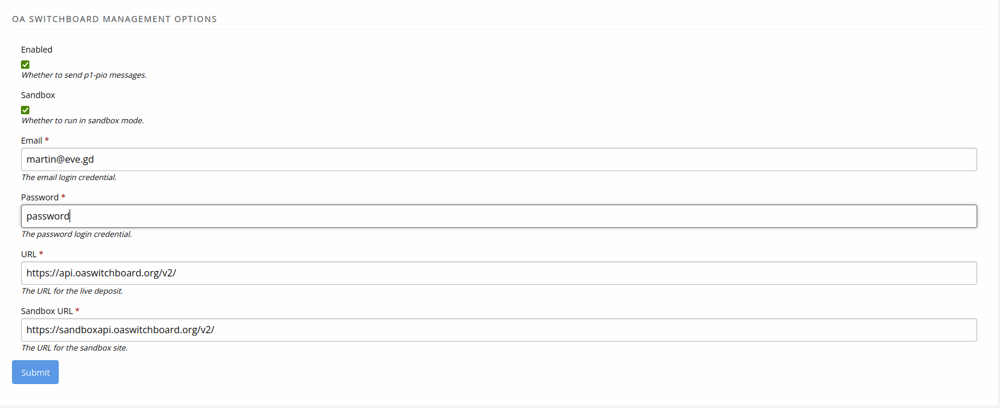
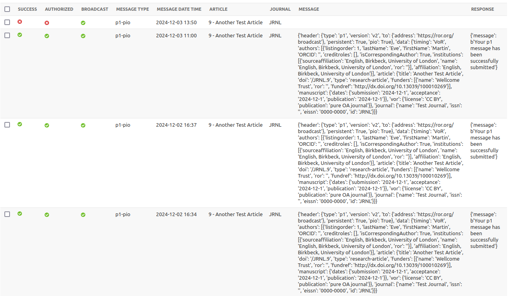

# Janeway OA Switchboard Plugin
This is a plugin for [Janeway](https://janeway.systems/) that enables [OA Switchboard](https://www.oaswitchboard.org/) p1-pio messages to be sent.

  

   

## Requirements
* Janeway 1.8.0 or above
* Python 3.10 (tested version)
* An [OA Switchboard](https://www.oaswitchboard.org/) account and credentials

## Note on Janeway Version Requirements
When running on Janeway 1.8, the plugin will send messages to the OA Switchboard, but without CRediT or ROR support, so messages will never be delivered. For these features, please use a later version.

## Installation
1. Clone this repository into the Janeway plugins folder.
2. From the `src` directory run `python3 manage.py install_plugins oas` (or the [equivalent Docker command](https://janeway.readthedocs.io/en/latest/dev/installation.html)).
3. Run the Janeway command  for running required migrations: `python3 manage.py migrate`
4. Restart your server (Apache, Passenger, etc)
5. You can then edit add your credentials and enable the plugin at <journal>/plugins/oa-switchboard/manager/.

## Plugin Setup
The main setup page can be accessed from the side menu in the journal manager. Here you can add your OA Switchboard credentials and enable the plugin.

The main options available are:

* Whether to send messages ("Enabled")
* Whether to send messages to the sandbox instead of the live site ("Sandbox")
* The email address with which to authorize
* The password with which to authorize
* The URL of the live API (default="https://api.oaswitchboard.org/v2/")
* The URL of the sandbox API (default="https://sandbox.oaswitchboard.org/v2/")

When you are done configuring all the options, press "Submit".

## Notes on Operation
Messages are sent to the OA Switchboard when an article is published (provided that the the plugin is enabled).

All messages are "broadcast", transmitted to https://ror.org/broadcast.

All messages are [p1-pio messages](https://www.oaswitchboard.org/blog-post-16oct2022).

The assumption made by the plugin is that the publication type is "pure OA journal". If your journal is "hybrid" or "transformative" you may need to change this.

The status of the p1-pio message will be displayed to the Editor when an article is published.

For the richest profile, include CRediT and RORs in your article metadata.

You can also inspect the status of all messages sent to the OA Switchboard by visiting the plugin's log page in the journal manager menu ("OA Switchboard Logs"). This will tell you where the problem is if messages are not sending.

* The "Success" column shows whether the message was sent successfully.
* The "Authorized" column shows whether the message was authorized. If this is red/negative, then there is a problem with your credentials.
* The "Broadcast" field shows whether this is a Broadcast message. As above, this is permanently true at present.
* The "Message Type" field shows the type of message sent. This is always "p1-pio" at present.
* The "Message Date Time" field shows the date and time the message was sent.
* The "Article" field shows the article to which the message relates.
* The "Journal" field shows the journal from which the message was sent.
* The "Message" field shows the message sent.
* The "Response" field shows the response from the OA Switchboard.

&copy; 2024 Martin Paul Eve. [Licensed under the AGPL 3.0](LICENSE).